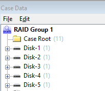
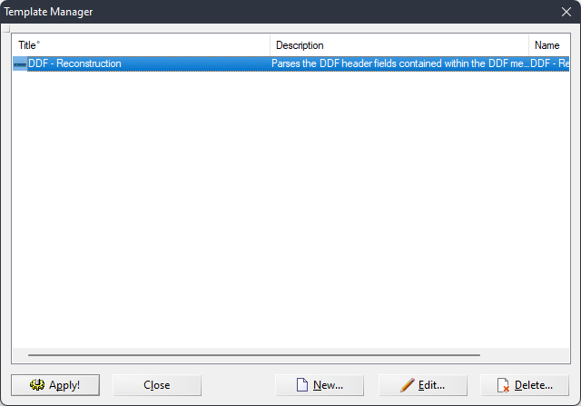
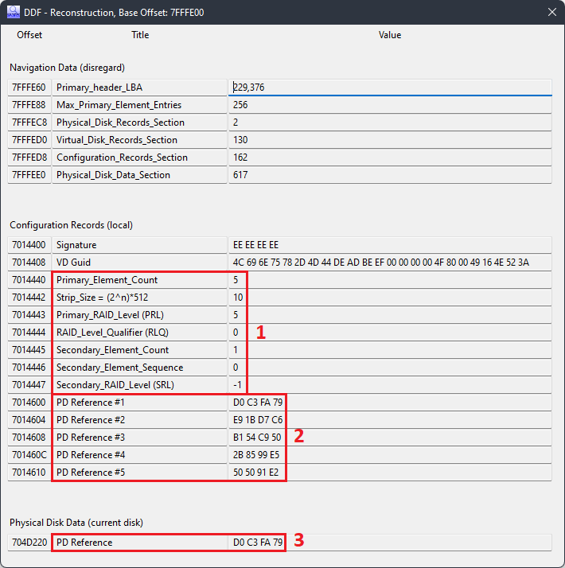
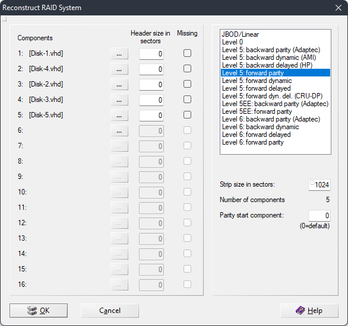
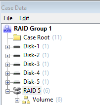

# Reconstruction Guide
_Using DDF Metadata to reconstruct a RAID array using X-Ways Forensics_

 

| Step | Details | Screenshot |
|:-: | - | - |
| **1.** |  Create a new case in XWF and add all disk images. | 
| **2.** | Select the first evidence object. In the **View** Menu select **Template Manager..**. (Alt+F12). Select the **DDF - Reconstruction** template. |  |
| **3.** | **Apply** the template (Enter).  Note the Note the details in the _Configuration Records_ and _Physical Disk Data_ section:   - The *VD GUID* may be used to uniquely identify a virtual disk.  - The first group (*Primary_Element_Count* through to *Secondary_RAID_Level*) are the reconstruction options, as per the tables above.  - The second group (*PD_Reference ##*) shows the order of PDs in the VD which the current disk is a member of.  - The third group shows the PD reference for the current disk.|  |
| **4.** | Repeat steps 2-3 for the remaining evidence objects (disks).  You may ignore most fields for subsequent disks in the same VD (as identified by the VD Guid) and just record the PD Reference. | _DIsk-1_: `D0 C3 FA 79` _Disk-2_: `B1 54 C9 50` _Disk-3_: `2B 85 99 E5` _Disk-4_: `E9 1B D7 C6` _Disk-5_: `50 50 91 E2`.
| **5.** | In the **Specialist** menu select **Reconstruct RAID System**. Enter components and options identified in the preceding steps.  - Select the RAID level/type based on the RLQ and PRL, translated in the table below.  - Take the strip size in sectors from the *Strip_Size* field extracted previously. *Note: X-Ways specifies this in sectors and the formula provided (`(2^n)*512`) calculates the strip size in _bytes_.  The **DDF-Reconstruction** template used here assumes a 512-byte sector, and if you made it this far the assumption is proven accurate.  The true formula is therefore `2^n`* |  |
| **6.** | Press **OK** to complete the reconstruction.  This will add a new item to the tab bar titled (in this example) _RAID 5: Disk-1 + Disk-4 + Disk-2 + Disk-3 + Disk-5_.  Right-Click this and add it to the case.  If you have completed all steps correctly, you will see the volume and data contained in the original volume(s) located on the RAID array. | 

 

## Translation Table
| PRL  | RLQ  | RAID Type                                         | X-Ways                                                                                            |
| ---- | ---- | ------------------------------------------------- | ------------------------------------------------------------------------------------------------- |
| `01` | `01` | RAID-1 Multi Mirroring                            | VD data is mirrored to all PDs.  No reconstruction is necessary; any PD from the VD has all data. |
| `03` | `00` | RAID-3 Non-Roating Parity 0                       | _Cannot be reconstructed._                                                                        |
| `03` | `01` | RAID-3 Non-Rotating Parity N                      | _Cannot be reconstructed._                                                                        |
| `04` | `00` | RAID-4 Non-Rotating Parity 0                      | May be possible if you disregard parity disk (and treat it as RAID-0. Testing needed.             |
| `04` | `01` | RAID-4 Non-Rotating Parity N                      | As above, thought he parity disk may not be first.                                                |
| `05` | `00` | RAID-5 Rotating Parity 0 with Data Restart        | Level 5: forward parity                                                                           |
| `05` | `02` | RAID-5 Rotating Parity N with Data Restart        | Level 5: backward parity                                                                          |
| `05` | `03` | RAID-5 Rotating Parity N with Data Continuation   | _Cannot reconstruct with data continuation.                                                       |
| `15` | `00` | RAID-5E Rotating Parity 0 with Data Restart       | _Cannot be reconstructed._                                                                        |
| `15` | `02` | RAID-5E Rotating Parity N with Data Restart       | _Cannot be reconstructed._                                                                        |
| `15` | `03` | RAID-5E Rotating Parity N with Data Continuation  | _Cannot be reconstructed._                                                                        |
| `25` | `00` | RAID-5EE Rotating Parity 0 with Data Restart      | **RAID**: Level 5EE: forward parity1                                                   |
| `25` | `02` | RAID-5EE Rotating Parity N with Data Restart      | Level 5EE: backward parity                                                                        |
| `25` | `03` | RAID-5EE Rotating Parity N with Data Continuation | _Cannot be reconstructed._                                                                        |
| `11` | `00` | Integrated Adjacent Stripe Mirroring              | Reconstruct as you would normally with a spanned VD (RAID-0), discarding every second disk.       |
| `11` | `01` | Integrated Offset Stripe Mirroring                | The 'unnecessary' blocks are consistent with a Level 6: forard parity, though this needs testing. |
| `06` | `01` | RAID 6 Rotating Parity 0 with Data Restart        | Level 6: forward parity.                                                                          |
| `06` | `02` | RAID 6 Rotating Parity N with Data Restart        | Level 6: backward parity.                                                                         |
| `06` | `03` | RAID 6 Rotating Parity N with Data Continuation   | _Cannot be reconstructed._                                                                        |